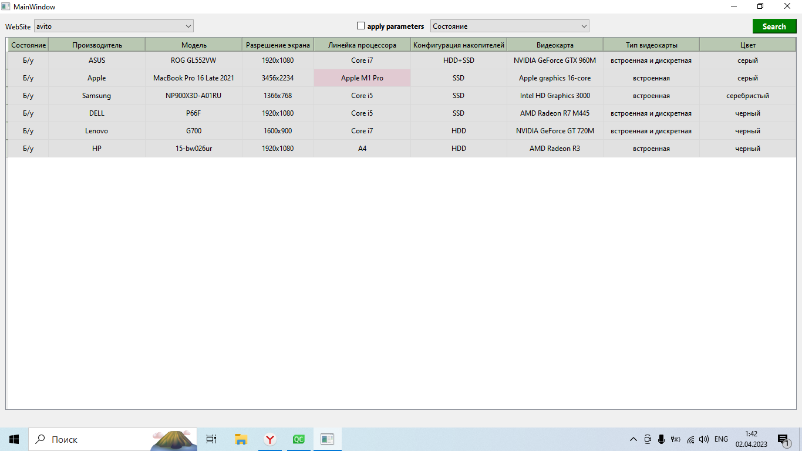

## Веб-скрейпинг
Парсятся характеристики ноутбуков с сайта авито. Используются классы QNetworkAccessManager и то что вокруг него, модель наследуется от QAbstractItemModel, элементы отображаются делегатом наследуемым от QStyledItemDelegate. Для фильтра QComboBox утановлена своя модель с чекбоксами.

Первоначальное состояние

После нажатия на кнопку "Search"

Применяется фильтр

После нажатия на "apply parametrs". Если снять галку, то снова отображаются все столбцы.

 
